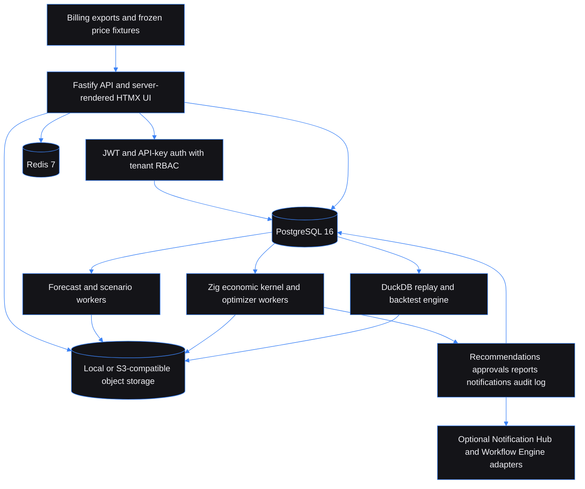

# Cloud Commitment Portfolio Optimizer - risk-bounded cloud commitment decisions

Built by [Kingsley Onoh](https://kingsleyonoh.com) · Systems Architect

## The Problem

Cloud commitments turn a forecast into a cash decision. A spreadsheet that optimizes headline discount can leave a team paying for unused capacity when usage changes, a migration slips, or a price table goes stale. This project gives CFOs, CTOs, and FinOps teams a tenant-scoped way to compare buy, resize, and no-action decisions under explicit downside budgets. The target audience is teams spending $50k or more per month on cloud, and the 12-month replay target is under 60 seconds for 1 million billing line items.

## Architecture



## Key Decisions

- I chose PostgreSQL with explicit SQL over an ORM because tenant ownership, immutable snapshots, and migration checks need to stay visible in the query and schema.
- I chose server-rendered HTMX pages over a browser-heavy single-page app because finance data should not be copied into a client bundle, and approval review must work with a small, predictable page.
- I chose Zig for the economic kernel over floating-point application code because the core formulas use canonical integer cents and deterministic fixture outputs.
- I chose file and fixture imports over live cloud SDKs because the standalone optimizer must work without provider credentials or an external service.

## Setup

### Prerequisites

- Node.js 22, 23, or 24 and npm 10 or 11
- Zig 0.14.1 for the economic kernel and golden fixtures
- Docker Compose for local PostgreSQL 16 and Redis 7

### Installation

```bash
git clone https://github.com/kingsleyonoh/cloud-commitment-portfolio-optimizer.git
cd cloud-commitment-portfolio-optimizer
npm install
```

### Environment

```bash
cp .env.example .env.local
```

Keep `.env.local`, password files, JWT files, and adapter keys outside Git. The table lists every variable in `.env.example`.

| Variable | Purpose |
|---|---|
| `NODE_ENV` | Runtime mode. |
| `PORT` | API port. |
| `PUBLIC_BASE_URL` | Browser origin used by session checks. |
| `APP_PUBLIC_URL` | Required HTTPS public origin in production Compose. |
| `LOG_LEVEL` | Structured log level. |
| `ALLOWED_ORIGINS` | Allowed browser origins. |
| `DEPLOYMENT_REGION` | Application region declaration. |
| `DATABASE_REGION` | Database region declaration. |
| `DATABASE_URL` | PostgreSQL connection URL. |
| `POSTGRES_PASSWORD` | Local or Compose PostgreSQL password. |
| `POSTGRES_PORT` | Local PostgreSQL port. |
| `DB_POOL_MAX` | Maximum PostgreSQL pool size. |
| `DB_POOL_IDLE_TIMEOUT_MS` | Idle connection timeout. |
| `DB_POOL_CONNECTION_TIMEOUT_MS` | PostgreSQL connection timeout. |
| `REDIS_URL` | Redis connection URL. |
| `REDIS_PORT` | Local Redis port. |
| `TEST_DATABASE_ADMIN_URL` | Isolated PostgreSQL admin URL for tests only. |
| `TEST_REDIS_URL` | Isolated Redis URL for tests only. |
| `DUCKDB_TEMP_DIR` | Temporary DuckDB workspace. |
| `OBJECT_STORAGE_MODE` | Object storage mode. The local implementation is supported. |
| `OBJECT_STORAGE_PATH` | Local object storage directory. |
| `SELF_REGISTRATION_ENABLED` | Enables public tenant registration. Off by default. |
| `SELF_REGISTRATION_PRODUCTION_ACK` | Second production registration acknowledgement. |
| `REGISTRATION_LIMITER_MODE` | Registration limiter mode. |
| `REGISTRATION_TRUSTED_PROXY_CIDRS` | Immediate proxy CIDRs trusted for registration IPs. |
| `REGISTRATION_EDGE_ENFORCES_LIMIT` | Declares an enforcing trusted edge. |
| `USERS_LIMITER_MODE` | Protected users-route limiter mode. |
| `USERS_TRUSTED_EDGE_ACK` | Acknowledges a trusted edge for users routes. |
| `USERS_TRUSTED_PROXY_CIDRS` | Immediate proxy CIDRs trusted for users-route IPs. |
| `DEFAULT_TENANT_NAME` | Name used for first-run tenant creation. |
| `DEFAULT_ADMIN_EMAIL` | Optional first administrator identity. |
| `DEFAULT_ADMIN_NAME` | Required with the first administrator identity. |
| `DEFAULT_ADMIN_PASSWORD_FILE` | Path to the first administrator password file. |
| `API_KEY_PREFIX` | Prefix for generated analyst API keys. |
| `JWT_PRIVATE_KEY_PATH` | RSA private key used only for local session issuance. |
| `JWT_PUBLIC_KEY_PATH` | RSA public key used for JWT verification. |
| `JWT_ISSUER` | Expected and issued JWT issuer. |
| `JWT_AUDIENCE` | Expected and issued JWT audience. |
| `JWT_ACCESS_TOKEN_MAX_LIFETIME_SECONDS` | Maximum access-token lifetime. |
| `JWT_CLOCK_TOLERANCE_SECONDS` | JWT clock tolerance. |
| `AUTH_ARGON_CONCURRENCY` | Concurrent password-hash jobs. |
| `AUTH_ARGON_QUEUE_LIMIT` | Maximum queued password-hash jobs. |
| `AUTH_LIMITER_MODE` | Authentication limiter mode. |
| `AUTH_TRUSTED_PROXY_CIDRS` | Immediate proxy CIDRs trusted for auth IPs. |
| `AUTH_COOKIE_SECURE` | Secure-cookie setting. Required in production. |
| `MAX_IMPORT_SIZE_MB` | Maximum import size. |
| `IMPORT_WORKER_CONCURRENCY` | Import worker concurrency declaration. |
| `PRICE_FIXTURE_PATH` | Price fixture directory. |
| `PRICE_TABLE_STALE_DAYS` | Price-table staleness threshold. |
| `DEFAULT_FORECAST_METHOD` | Default forecast method. |
| `MIN_HISTORY_DAYS` | Minimum usage history for forecasts. |
| `FORECAST_RANDOM_SEED` | Default forecast seed. |
| `FORECAST_WORKER_CONCURRENCY` | Forecast worker concurrency declaration. |
| `OPTIMIZER_MAX_CANDIDATES` | Maximum optimizer candidates. |
| `OPTIMIZER_TIMEOUT_SECONDS` | Optimizer time limit. |
| `DEFAULT_DOWNSIDE_CONFIDENCE` | Default downside confidence level. |
| `MAX_PARALLEL_OPTIMIZER_RUNS` | Parallel optimizer-run limit. |
| `BACKTEST_MAX_MONTHS` | Maximum backtest window. |
| `BACKTEST_WORKER_CONCURRENCY` | Backtest worker concurrency declaration. |
| `REPLAY_RANDOM_SEED` | Default replay seed. |
| `REPORT_STORAGE_PATH` | Report object directory. |
| `APPROVAL_EXPIRY_HOURS` | Approval expiry window. |
| `NOTIFICATION_HUB_ENABLED` | Enables the optional Notification Hub adapter. |
| `NOTIFICATION_HUB_URL` | Notification Hub URL. |
| `NOTIFICATION_HUB_API_KEY` | Notification Hub credential supplied at runtime. |
| `WORKFLOW_ENGINE_ENABLED` | Enables the optional Workflow Engine adapter. |
| `WORKFLOW_ENGINE_URL` | Workflow Engine URL. |
| `WORKFLOW_ENGINE_API_KEY` | Workflow Engine credential supplied at runtime. |
| `WORKFLOW_APPROVAL_WORKFLOW_ID` | Workflow ID for approval triggers. |
| `INVOICE_RECON_ENABLED` | Future Invoice Reconciliation flag. Kept disabled. |
| `INVOICE_RECON_CONTRACT_VERIFIED` | Contract verification flag. |
| `INVOICE_RECON_URL` | Reserved future adapter URL. |
| `INVOICE_RECON_API_KEY` | Reserved future adapter credential. |
| `SENTRY_DSN` | Optional Sentry-compatible error destination. |
| `OTEL_EXPORTER_OTLP_ENDPOINT` | Optional OpenTelemetry collector endpoint. |
| `POSTHOG_KEY` | Optional PostHog-compatible analytics key. |
| `POSTHOG_HOST` | Optional PostHog-compatible analytics host. |
| `DEMO_MODE` | Public-demo safety mode. |

### Run

```bash
docker compose up -d postgres redis
npm run setup
npm run dev
```

Run the worker in a second terminal:

```bash
npm run worker:dev
```

`npm run setup` applies ordered migrations and initializes the first tenant. When a new API key is created, the command prints its plaintext once. Keep it in a local shell variable and never commit it.

## How It Works

```text
Billing export
    ↓
Tenant-scoped canonical usage rows and control totals
    ↓
Forecast distribution and optional scenario shock
    ↓
Frozen price table + risk policy + random seed
    ↓
Optimizer candidates and efficient frontier
    ↓
Buy, resize, or no-action recommendation
    ↓
Approval, immutable report snapshot, audit event, optional notification
```

The optimizer keeps expected savings beside utilization, confidence, p95 downside, liquidity cost, and the constraint that limited the result. A later price-table activation or tenant identity edit cannot change a frozen recommendation report.

## Usage

The quickest path is to run setup, create a cloud account with the printed analyst API key, place a billing file in configured object storage, then create an import, forecast, and optimizer run. The analyst key can use the explicitly allowed automation routes. Price-table creation and activation require a Tenant Admin JWT.

### Check the service

```bash
curl http://localhost:8080/health
# {"status":"ok"}
```

### Create an account

```bash
export CCPO_API_KEY='SET_FROM_SETUP_OUTPUT'

curl -sS -X POST http://localhost:8080/api/cloud-accounts \
  -H "X-API-Key: $CCPO_API_KEY" \
  -H 'Content-Type: application/json' \
  --data '{
    "provider": "aws",
    "external_ref": "payer-reference",
    "display_name": "Production payer",
    "currency": "USD",
    "tags": {"environment": "production"}
  }'
```

The `201` response contains `id`, `provider`, `external_ref`, `display_name`, `currency`, `tags`, `is_active`, `created_at`, and `updated_at`. Save the returned `id` as `CLOUD_ACCOUNT_ID`.

### Register an import

Put a canonical CSV at the object key named by `object_uri` in the configured object store, then submit its control totals:

```bash
export CLOUD_ACCOUNT_ID='id-from-the-account-response'

curl -sS -X POST http://localhost:8080/api/imports \
  -H "X-API-Key: $CCPO_API_KEY" \
  -H 'Content-Type: application/json' \
  --data '{
    "source": "synthetic",
    "format": "csv",
    "object_uri": "imports/demo/synthetic.csv",
    "cloud_account_id": "'"$CLOUD_ACCOUNT_ID"'",
    "control_totals": [{
      "provider": "aws",
      "service_code": "AmazonEC2",
      "region": "us-east-1",
      "month": "2026-01",
      "line_count": "1",
      "usage_quantity": "1.00000000",
      "on_demand_cost_cents": "10000",
      "realized_cost_cents": "10000",
      "commitment_applied_cents": "0"
    }]
  }'
```

The `201` response contains a completed or quarantined import batch. The service writes canonical usage rows only after control totals reconcile. AWS CUR CSV uses the provider column mapping in `docs/import-mappings.md` during local development.

### Create and run a forecast

```bash
curl -sS -X POST http://localhost:8080/api/forecast-models \
  -H "X-API-Key: $CCPO_API_KEY" \
  -H 'Content-Type: application/json' \
  --data '{
    "name": "Monthly AWS baseline",
    "provider_scope": ["aws"],
    "service_scope": ["AmazonEC2"],
    "horizon_months": 3,
    "method": "seasonal_naive",
    "config": {"seasonality": "monthly"}
  }'

export FORECAST_MODEL_ID='id-from-the-model-response'
curl -sS -X POST http://localhost:8080/api/forecast-runs \
  -H "X-API-Key: $CCPO_API_KEY" \
  -H 'Content-Type: application/json' \
  --data '{
    "forecast_model_id": "'"$FORECAST_MODEL_ID"'",
    "input_window_start": "2026-01-01",
    "input_window_end": "2026-03-31",
    "horizon_months": 3,
    "random_seed": "20260826"
  }'
```

The model response includes its lifecycle status. The forecast-run response includes `id`, `status`, input window, horizon, random seed, output URI, quality metrics, and bounded error details. The worker writes a deterministic forecast artifact to object storage.

### Queue an optimizer run

Create and activate a price table and an optimizer policy as a Tenant Admin first. Then use the analyst key or an authorized JWT to freeze the forecast, policy, scenario, and price versions into a run:

```bash
export OPTIMIZER_POLICY_ID='active-policy-id'
export PRICE_TABLE_VERSION_ID='active-price-table-id'
export FORECAST_RUN_ID='id-from-the-forecast-run-response'

curl -sS -X POST http://localhost:8080/api/optimizer-runs \
  -H "X-API-Key: $CCPO_API_KEY" \
  -H 'Content-Type: application/json' \
  --data '{
    "forecast_run_id": "'"$FORECAST_RUN_ID"'",
    "optimizer_policy_id": "'"$OPTIMIZER_POLICY_ID"'",
    "price_table_version_ids": ["'"$PRICE_TABLE_VERSION_ID"'"]
  }'
```

The `201` response returns the queued run. Read `/api/optimizer-runs/{id}` until the status is `completed` or `infeasible`. A completed run exposes the frontier summary and creates tenant-scoped recommendations. An infeasible run preserves ranked relaxation suggestions instead of hiding the constraint.

### Read the report

```bash
export RECOMMENDATION_ID='recommendation-id-from-the-list-response'
curl -sS \
  -H "X-API-Key: $CCPO_API_KEY" \
  "http://localhost:8080/api/reports/recommendation/$RECOMMENDATION_ID"
```

The report response contains an immutable `report_snapshot`, the frozen input context, and rendered HTML storage metadata. The browser views at `/dashboard`, `/accounts`, `/imports`, `/forecasts`, `/optimizer-runs`, and `/recommendations/{id}` use the same tenant-scoped services.

### What it handles

| Concern | Built-in behavior |
|---|---|
| Ownership | Tenant-leading database ownership checks and non-enumerating cross-tenant errors. |
| Forecasting | Deterministic seasonal-naive forecast runs with quality metrics and warnings. |
| Economics | Integer-cent formulas, provider/instrument validation, efficient frontiers, downside budgets, and infeasibility reasons. |
| Evidence | Frozen price, forecast, scenario, policy, and report snapshots. |
| Human control | Approval requests, role checks, expiry handling, and audit events. |
| External services | Optional Notification Hub and Workflow Engine adapters. The core flow works with both disabled. |
| Privacy | Credential-free imports, bounded diagnostics, no raw billing rows in rendered pages, and explicit sharing guidance. |

## Tests

```bash
npm run test:setup
npm test
zig build test
npm run fixtures:golden
npm run test:integration
npm run test:e2e
```

The aggregate command runs the same sequence:

```bash
npm run test:all
```

Useful release checks are `npm run typecheck`, `npm run lint`, `npm run format:check`, `npm run build`, `npm run check:toolchain`, `npm run bench:optimizer`, and `npm audit --audit-level=moderate`.

## AI Integration

This project includes machine-readable discovery files:

| File | What it does |
|---|---|
| [`llms.txt`](llms.txt) | Project summary for AI tools. |
| [`openapi.yaml`](openapi.yaml) | OpenAPI 3.1 API specification. |
| [`mcp.json`](mcp.json) | MCP server definition. |

## Deployment

The production Compose file runs the API, a migration gate, a polling worker, PostgreSQL, Redis, and persistent local object storage. Optional adapters stay disabled unless their runtime flags and credentials are supplied. Invoice Reconciliation remains disabled until its endpoint contract is verified.

### Production stack

| Component | Role |
|---|---|
| `postgres` | PostgreSQL 16 database. |
| `redis` | Redis 7 queue, cache, and limiter dependency. |
| `migrate` | One-shot ordered migration runner. |
| `app` | Fastify API and server-rendered UI on port 8080. |
| `worker` | Forecast, optimizer, approval, backtest, notification, and adapter processing. |
| `app_objects` | Persistent object storage for imports, forecasts, optimizer outputs, reports, and replay artifacts. |

### Self-host

```bash
docker compose --env-file .env.production -f docker-compose.prod.yml config
docker compose --env-file .env.production -f docker-compose.prod.yml up -d --build
docker compose --env-file .env.production -f docker-compose.prod.yml ps
```

Set the required production variables, mount matching RSA public/private key files, and use an HTTPS `APP_PUBLIC_URL` before starting. See [`docs/deployment.md`](docs/deployment.md) for upgrade, backup, restore, and readiness procedures.

<!-- THEATRE_LINK -->
